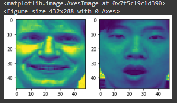

# Validación de identidad
El objetivo de este repositorio es generar dos estrategias de validación de identidad para una persona: reconocimiento facial y estrés de voz.

Para la validación, usando la cámara y micrófono del dispositivo en uso se pedirá a la persona responder ciertas preguntas acerca de su identidad, adicional a ello se pedirá una fotografía del documento original de identidad de la persona donde se encuentre una fotografía.

## Reconocimiento facial
Para el reconocimiento facial se requieren dos inputs: Foto de un documento de identidad donde se vea el rostro, video de su rostro tomado en el momento de hacer la validación.
Durante la toma del video se pide a la responder ciertas preguntas frente a la camára, del video resultante se extraen 3 frames los cuales serán comparados con la fotografia de rostro reconocida en el documento de identidad se valida la coincidencia en las imágenes.

## Estres de voz

Con la intención de determinar cuando una persona podría estar mintiendo se analiza el audio recogido en el video inicial donde la persona responde preguntas acerca de su identidad, (Ej. se pide decir viendo a la camara yo soy.. con .... años de edad, mi fecha de nacimiento es ..... vivo en la ciudad de...), este audio será sometido a una prueba de estres de voz donde se determina el estres en la voz al responder las preguntas. Con eso se puede asumir que una voz estresada o en otras palabras nerviosa  puede relacionarse con el acto de mentir.

# Contenido

#### [Procesamiento y modelamiento de datos](#Procesamiento-y-modelamiento-de-datos)

1. [Datos de video](#Datos-de-video)
    1. [Pre-procesamiento de imagen](#Pre-procesamiento-de-imagen)
    2. [Construcción del conjunto de datos](#Construcción-del-conjunto-de-datos) 
    3. [Modelo de validación de identidad con imagenes](#Modelo-de-validación-de-identidad-con-imagenes)
2. [Datos de Audio](#Datos-de-Audio)
    1. [Preprocesamiento del audio (Audio a espectograma)](#Preprocesamiento-del-audio-(Audio-a-espectograma))
    2. [Construcción del conjunto de datos](#Construcción-del-conjunto-de-datos)
    3. [Modelo estrés de voz](#Modelo-estrés-de-voz)

# Procesamiento y modelamiento de datos
## Datos de video
###  Pre-procesamiento de imagen
El proyecto tendrá como objetivo la identificacion de rostro. 
Para esto se usará una red pre-entrenada ([dlib face recognition](http://dlib.net/)) que es capaz de reconocer el area del rostro posando de manera frontal.

#### Propuesta de pre-procesamiento del dato

El objetivo es conectar el programa a la camará de algún dispositivo a disposición del usuario y tomar un video:

1. Del video se extraerán imagenes
2. De cada imagen se identificará el rostro eliminando información no util, por ejemplo, el fondo, las orejas, cabello y cuello.
3. Se pone en escala de grises
4. Se redimensionan las imagenes

#### Construcción del conjunto de datos

Para el entrenamiento de reconocimiento de rostro se usará como base el conjunto de datos [YALE FACE DATABASE](http://vision.ucsd.edu/content/yale-face-database) donde se tiene el rostro de  15 personas con 11 fotos por persona,una por cada expresión o configuración facial diferente: 
1. luz central
2. Con lentes
3. Feliz
4. Luz izquierda
5. Sin lentes
6. Normal
7. Luz derecha
8. Triste
9. Somnoliento
10. Sorprendido
11. Guiño

El objetivo es combinar por pares de fotografias, esta tarea se dicide en dos partes:
1. preprocesar las imagenes obteniendo de ellas solo el rostro y convertirlas en tensor.

2. Cada posible pareja de imagenes se almacena en un solo tensor, es decir, el tensor resultante tendrá 2 canales, en cada canal un rostro.

3. Se asigna el target a cada parreja de rostros, si los rostros pertencen a la misma persona, el target será 1, de lo contrario será 0.

#### Modelo de validación de identidad con imagenes

## Datos de Audio
### Preprocesamiento del audio (Audio a espectograma)
### Construcción del conjunto de datos
### Modelo estrés de voz

